# Elektronik Aufbau

## Erforderliches Werkzeug

Für den Aufbau werden benötigt:

* Gabel- oder Ringschlüssel
* ein Seitenschneider
* ein Lötkolben und Lötzinn

## Befestigung der Motorsteuerung

Die Motorsteuerung bekommt zunächst zwei Abstandshalter, die lediglich als Auflage dienen. Die mitgelieferten Senkkopfschrauben sind für die Befestigung nicht besonders gut geeignet. Beim Anziehen der Schrauben ist darauf zu achten, dass nicht zu fest zugedreht wird, da ansonsten die Platine brechen könnte.

Wer passende Schrauben mit flachem Kopf zur Verfügung hat, ist gut beraten, diese zu verwenden.

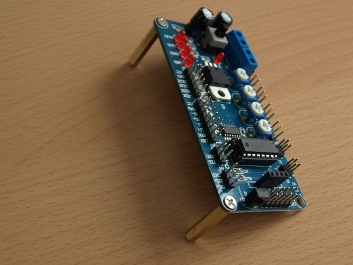

Um die Motorsteuerung auf der Platte zu befestigen, werden zwei Abstandshalter wie im Bild angebracht. Auf korrekte Ausrichtung der Platte ist zu achten (siehe letzter Schritt bei [Mechanischer Aufbau](Mechanischer%20Aufbau.md)).

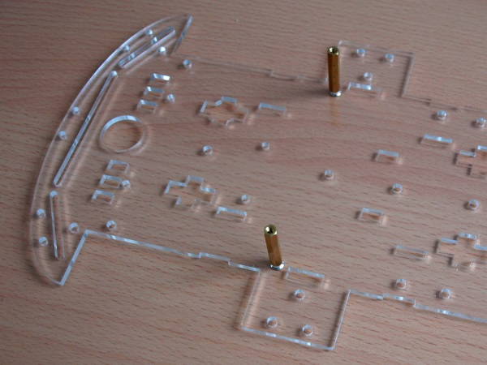

Zusammengebaut ergibt sich:

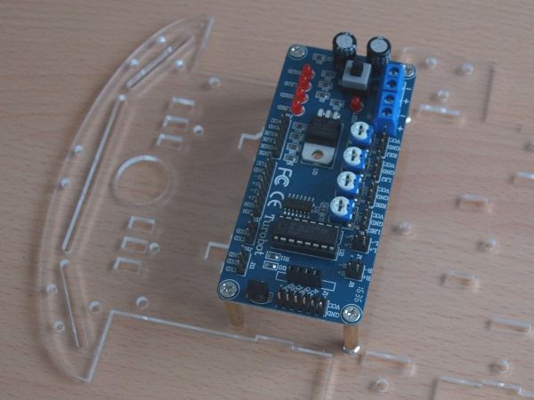

## Arduino Stiftleisten

Die Stiftleisten für den Arduino werden am Stück geliefert und müssen zugeschnitten werden. Da sich die Anzahl der Stifte jeweils unterscheidet, empfiehlt es sich, die Stiftleiste mit den kurzen Beinchen in die vorhandenen Buchsen zu stecken und dann entsprechend abzuknipsen.

Der Seitenschneider im Bild ist eher zu groß. Ein kleinerer Elektronik-Seitenschneider wäre sicherlich geschickter.

Die zugeschnittenen Stiftleisten werden parallel zu den vorhandenen Buchsen eingelötet. Die kurzen Beinchen werden durch die Platine gesteckt, damit die langen Beinchen für die Verbinder zur Verfügung stehen.

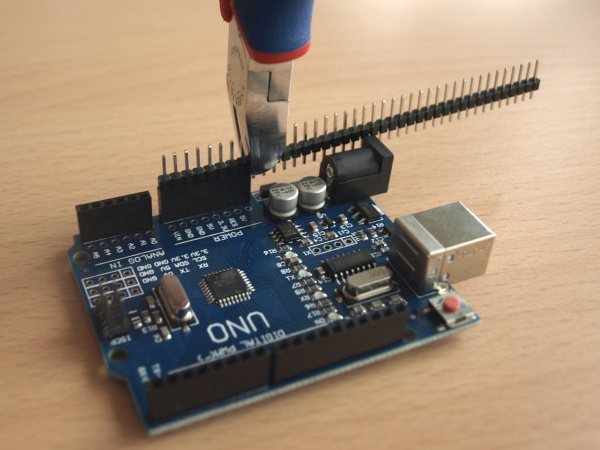
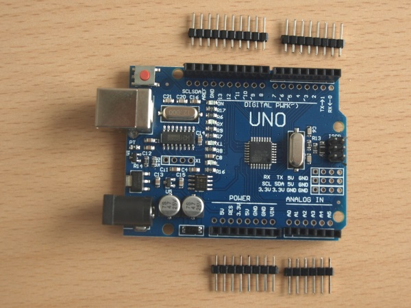
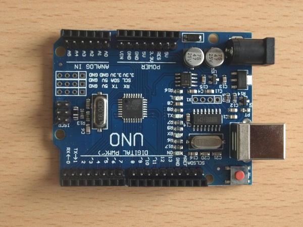

## Befestigung des Arduinos

Ähnlich wie die Motorsteuerung wird auch der Arduino zwar auf vier Abstandshaltern aufgestellt, jedoch nur zwei davon lassen sich festschrauben. Auch hier gilt die Empfehlung wie bei der Motorsteuerung: flache Schrauben verwenden, sofern vorhanden.

Nach dem Anbringen unbedingt die Drehung auf der Unterseite überprüfen! Der Abstandshalter sollte keinen Kontakt zum danebenliegenden Pin haben.

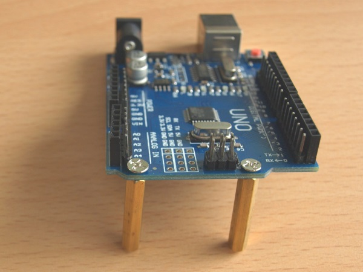
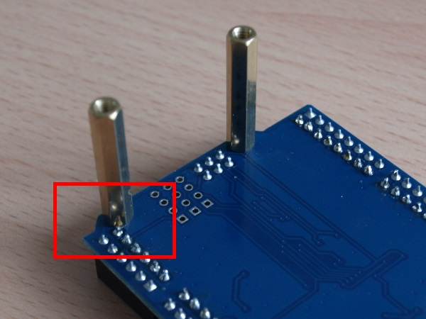

Auf der Platte werden die zwei anderen Abstandshalter befestigt, dann der Arduino daran angebracht:

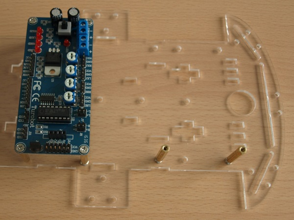
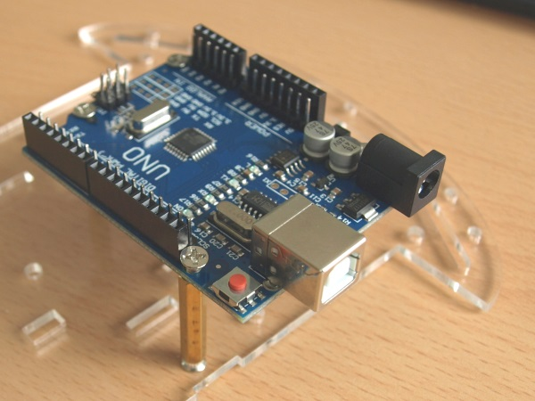

## Der Servo

Am Servo wird zunächst die Plexiglasplatte mit den Schlitzen befestigt.

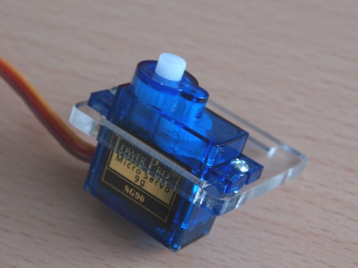

Auf dem Servo wird die Halterung für den Ultraschallsensor angeschraubt. Es ist möglich, dass die Schraube zu lang ist und bei Drehen am Servo hängenbleibt. Daher muss die Schraube gekürzt werden.

Hinweis zum Bild: die Plexiglasplatte fehlt hier.

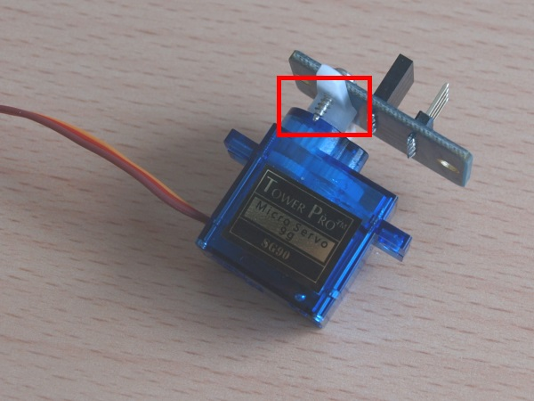