# Mechanischer Aufbau

## Erforderliches Werkzeug

Für den Aufbau werden benötigt:

* einen Seitenschneider
* eine Abisolierzange
* ein Lötkolben und Lötzinn
* Gabelschlüssel
* Gabel- oder Ringschlüssel

## Motoren vorbereiten

Die Motoren kommen mit Lötfahnen, haben jedoch noch keine praktischen Steckverbinder, mit denen sie später verbunden werden können. Zunächst gilt es, diese Verbindungsmöglichkeit herzustellen. Im eingebauten Zustand ist das später fast nicht mehr möglich, daher empfiehlt sich, diesen Schritt zu Beginn durchzuführen.

1. Zwei Verbindungskabel abtrennen
2. Auf einer Seite die Steckverbinder mit dem Seitenschneider abtrennen
3. Ein kurzes Stück abisolieren
4. Jeweils einen Draht mit einer Lötfahne verlöten
5. Schutzfolie vom Lichtschrankenrad entfernen
6. Lichtschrankenrad auf der Achse anbringen

Diese Schritte für alle vier Motoren wiederholen.

Ungefähr erwartetes Ergebnis für einen Motor:

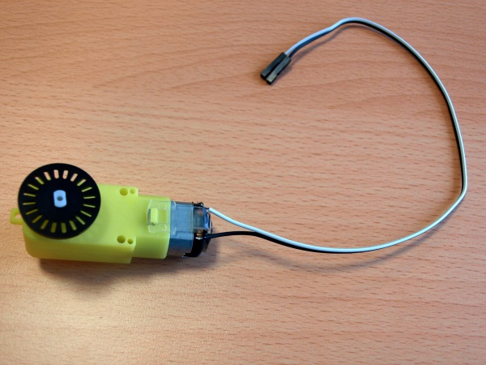

## Motorhalterung befestigen

Die Motoren werden im nächsten Schritt mit den Halterungen verbunden.

1. Halterung von Schutzfolie befreien
2. Eine Schraube durch das Langloch des Halters stecken
2. Motor auf die Schraube stecken so dass die Lichtschranke vom Halter wegzeigt
3. Zweite Schraube durch die Halterung und den Motor stecken

Diese Schritte für alle vier Motoren wiederholen.

In Bildern:

Achtung! Deine Motoren sollten jeweils Verbindungsdrähte angelötet haben.

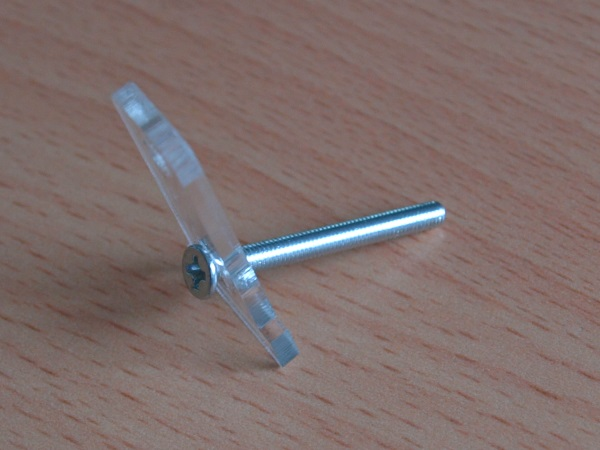
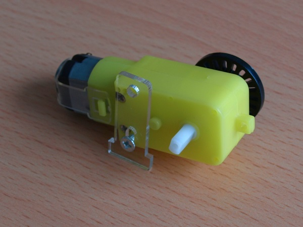
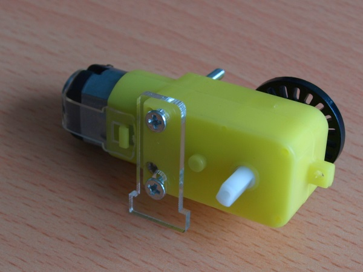

## Motoren am Chassis befestigen

Jetzt können die Motoren auf der Grundplatte montiert werden.

1. Schutzfolie von der zweiten Halterung entfernen
2. Zweite Halterung von unten durch die Grundplatte stecken
2. Motor in Halterung seitlich gegen die zweite Halterung schieben
3. Mit Muttern befestigen

Diese Schritte müssen wiederum für alle vier Motoren wiederholt werden. Die elektrischen Anschlüsse zeigen jeweils zur Mitte.

Achtung! Deine Motoren sollten jeweils Verbindungsdrähte angelötet haben.

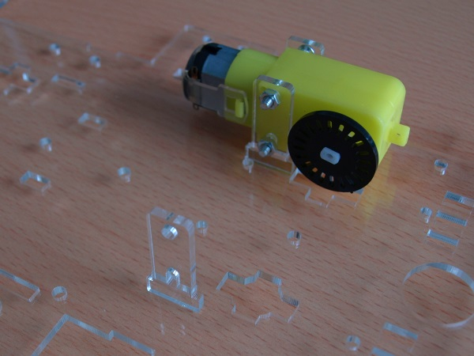

## Räder anbringen

Wenn die Räder angebracht werden, sieht das Ergebnis schon fast nach einem Auto aus.

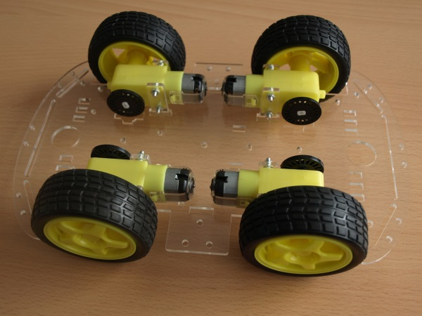

## Abstandshalter montieren

Um dem Gebilde etwas Stabilität zu geben, werden zunächst sechs Abstandshalter befestigt, dann die zweite Grundplatte montiert. Die Abstandshalter können in Seitenlage oder auf dem Kopf gut montiert werden. Mit den Gabel- und Ringschlüsseln können die Muttern etwas angezogen werden.

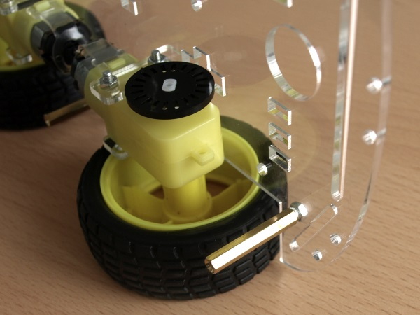
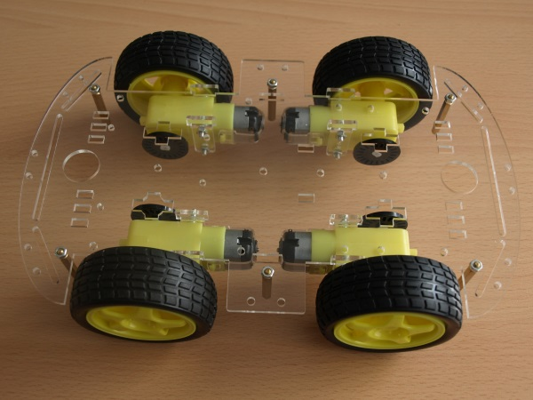

## Das fehlende Stück Handbuch

Im mitgelieferten Handbuch wird im nächsten und letzten Schritt die zweite Platte montiert. Falls man das jetzt schon macht, bleiben folgende Teile übrig. Quasi die komplette Elektronik bleibt unberücksichtigt. Genau aus diesem Grund entsteht diese Anleitung.

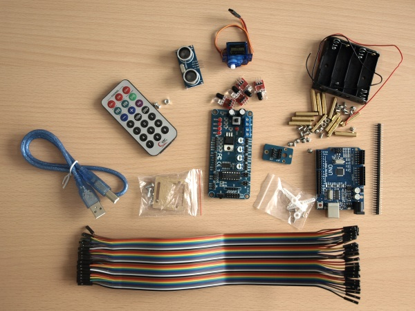

## Vorbereitung Elektronikaufbau

Vor dem Anbringen der zweiten Platte ist zu prüfen, ob die Ausrichtung stimmt. Die Platte ist nicht exakt spiegel- und punktsymmetrisch. Falls die Bohrungen nicht genau passen, dann muss die Platte ggf. gedreht oder gewendet werden.

Wenn die Lage bestimmt wurde, kann mit der Befestigung der Elektronik begonnen werden. Bis dahin bleibt die Platte jedoch lose, da Schrauben oder Muttern von unten angebracht werden müssen.

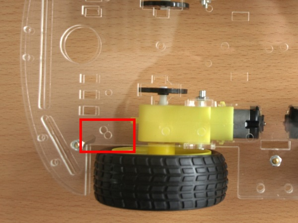
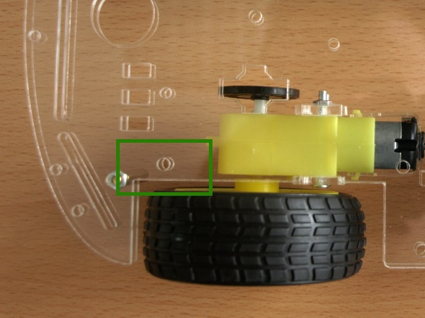